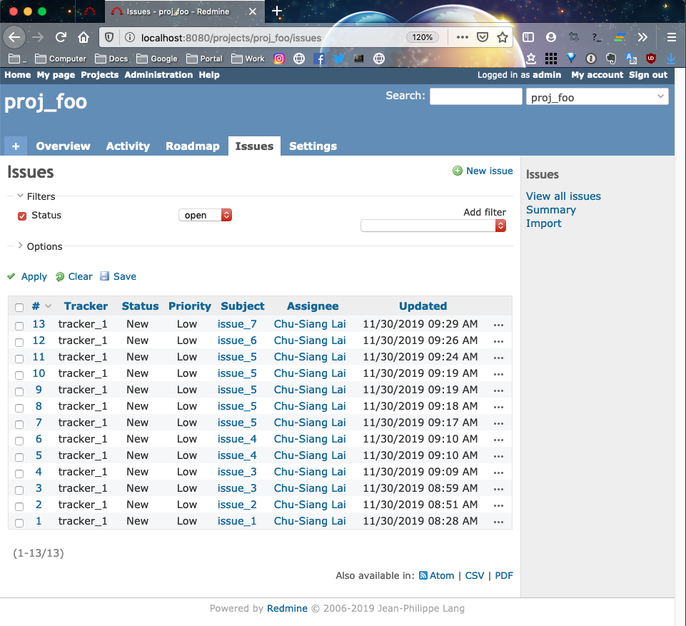

# Create Redmine issues

Quick create each issues on Redmine via Python.

## Requirements

1. Python 3
1. Docker (option)
1. Git.
1. Make.
1. docker-compose (option)

## Dependencies

1. [python-redmine](https://github.com/maxtepkeev/python-redmine/)
1. [requests](https://github.com/psf/requests)

## Setup

1. Get this project.

    ```
    $ git clone git@github.com:chusiang/create-redmine-issue.git && cd create-redmine-issue
    ```

1. Create the virtual environment.

    ```
    $ virtualenv -p python3 .venv
    ```

1. Enable the virtual environment.

    ```
    $ . .venv/bin/activate
    (.venv) $
    ```

1. Install dependencies packages.

    ```
    (.venv) $ pip3 install -r requirements.txt
    ```

### Run Redmine via docker (opetion)

```
$ docker-compose up -d
```

## Initialization on Redmine

1. Add new user, role and group.
1. Add new record in **Roles**, **Trackers**, **Issue status** and **Workflow**.
1. Try to manual create one new issue.
1. Enable the **REST web service** args.

## Run

1. Edit `create_issues.py` for update issue context.

    ```
    (.venv) $ vim create_issues.py
    ...
    ```

1. Create new issues via script.

    ```
    (.venv) $ python create_issues.py
    ```

1. Result.

    

## Known Issue

TBD.

## License

Copyright (c) chusiang from 2019 under the MIT license.
